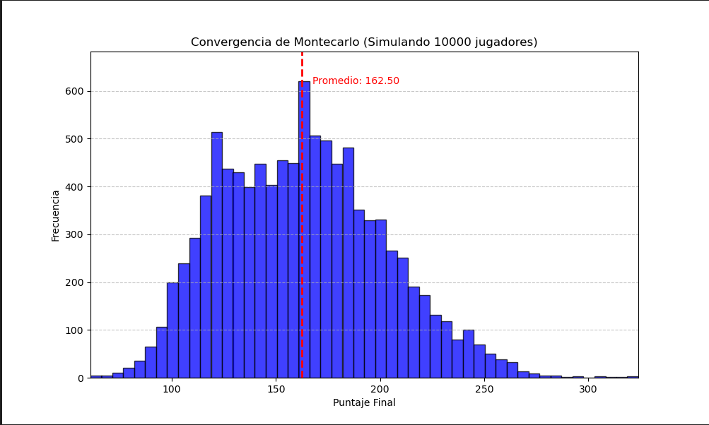

# Simulación de Montecarlo: Yahtzee



Este proyecto es una aplicación del método de Montecarlo para analizar el juego de Yahtzee. En lugar de jugar una sola vez, este script simula miles de partidas completas entre dos "bots" automáticos para descubrir patrones estadísticos, como el puntaje promedio y la distribución de todos los resultados posibles.

El código está diseñado para ejecutarse en un **Jupyter Notebook** (`.ipynb`).

## Características

* **Simulación de Juego Completo:** Modela las 13 rondas de una partida de Yahtzee de 2 jugadores.
* **Jugador Bot:** Ambos jugadores utilizan una estrategia "codiciosa" (greedy) predefinida para decidir qué dados guardar y dónde anotar.
* **Análisis Estadístico:** Después de simular $N$ juegos (ej. 5,000), calcula la media, mediana, desviación estándar, máximo y mínimo de todos los puntajes.
* **Visualización Animada:** Genera una animación que muestra cómo la distribución de puntajes (histograma) "converge" hacia un patrón estable a medida que se simulan más y más juegos.

## Requisitos

Para ejecutar este notebook, necesitarás las siguientes librerías de Python:

* `random` (incluida en Python)
* `collections.Counter` (incluida en Python)
* `numpy`
* `matplotlib`
* `IPython` (para mostrar la animación)

Puedes instalarlas usando pip:
```bash
pip install numpy matplotlib